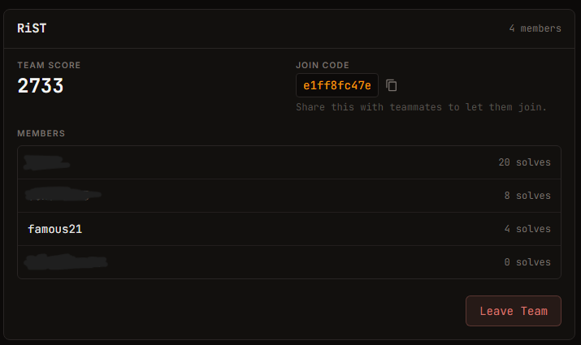
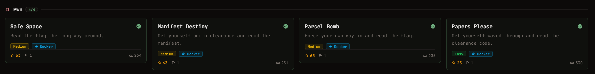

# H7CTF - Recap
## 結果

Team score 2733, 211位でフィニッシュでした。

## 感想
常設じゃないCTFは久しぶりの参加。常設のCTFも全然サボってますが。
team score自体は2733でしたが、僕が貢献したのはせいぜい200ポイントくらいだと思います。
僕がMediumに苦戦している中みんなhardやinsaneに挑戦していました。すごい。

解いたのはpwnの四問だけ。Easy1つとMedium3つですね。
しかもそのうち一問（Percel Bomb）はほぼAIに頼って解いてしまったので何とも言えない...
(ret2dlsolveだと思ってたら全然違ったっていう。まだまだ勉強が必要ですね。)

そういえば今回久しぶりにGhidraを使いました。
今までソースコードが配布されてるpwnばっかりやってたのでちょっとビビりましたが、あんまりいつもと変わらなかった。

AIに解かせた問題も含め、復習して順次writeupを書いていこうと思います。